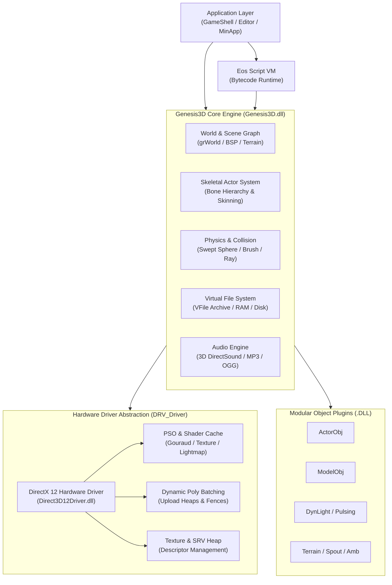
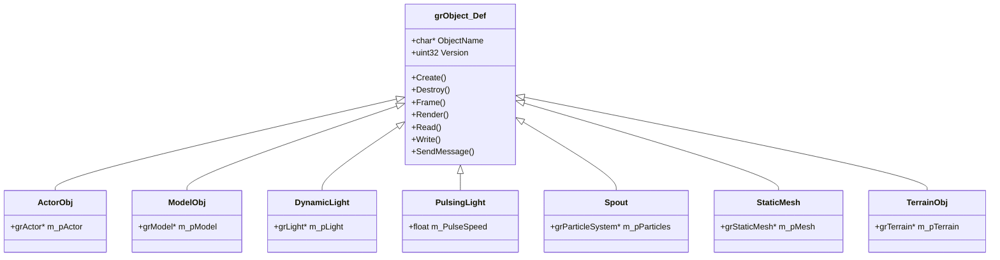
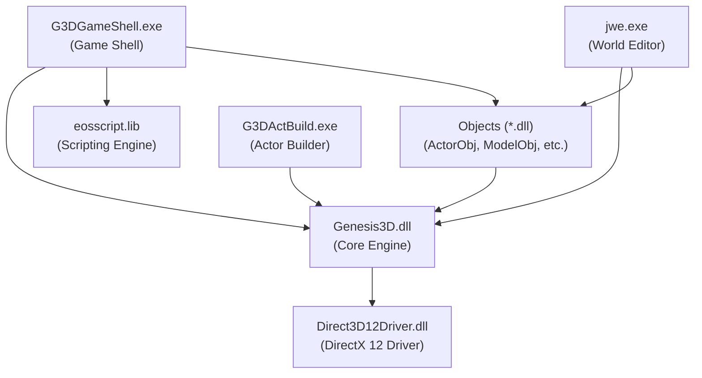

# Genesis3D: Reborn - Master Codebase Index & Architecture Reference

This document serves as the comprehensive architectural reference and complete code index for **Genesis3D: Reborn**. It catalogs all modules, subsystems, drivers, object plugins, developer tools, and public headers across the repository, explaining **what exists**, **what it does**, **how it does it**, and **where it is located on disk**.

---

## Table of Contents

1. [Architectural Overview & System Philosophy](#1-architectural-overview--system-philosophy)
2. [Directory Structure & Repository Layout](#2-directory-structure--repository-layout)
3. [Public API & Include Reference (`include/`)](#3-public-api--include-reference-include)
4. [DirectX 12 Hardware Rasterizer Driver (`Renderer/Direct3D12/`)](#4-directx-12-hardware-rasterizer-driver-rendererdirect3d12)
5. [Core Engine Subsystems (`Engine/Genesis3D/`)](#5-core-engine-subsystems-enginegenesis3d)
   - [5.1 Actor & Skeletal Animation System (`Actor/`)](#51-actor--skeletal-animation-system-actor)
   - [5.2 Bitmap & Texture Processing Pipeline (`Bitmap/`)](#52-bitmap--texture-processing-pipeline-bitmap)
   - [5.3 BSP & World Geometry Engine (`Bsp/`)](#53-bsp--world-geometry-engine-bsp)
   - [5.4 World Database & Scene Graph (`guWorld/`)](#54-world-database--scene-graph-guworld)
   - [5.5 3D Mathematics Subsystem (`Math/`)](#55-3d-mathematics-subsystem-math)
   - [5.6 Particle Simulation Engine (`Particle/`)](#56-particle-simulation-engine-particle)
   - [5.7 Collision Detection & Physics (`Physics/`)](#57-collision-detection--physics-physics)
   - [5.8 Continuous LOD Terrain Subsystem (`Terrain/`)](#58-continuous-lod-terrain-subsystem-terrain)
   - [5.9 Virtual File System (`VFile/`)](#59-virtual-file-system-vfile)
   - [5.10 Audio Subsystem & Music Streaming (`Sound/`, `Mp3Mgr/`)](#510-audio-subsystem--music-streaming-sound-mp3mgr)
   - [5.11 Memory Allocation & Diagnostic Support (`Support/`)](#511-memory-allocation--diagnostic-support-support)
   - [5.12 Networking Subsystem (`CSNetMgr.cpp`, `Netplay.cpp`)](#512-networking-subsystem-csnetmgrcpp-netplaycpp)
   - [5.13 Video Playback Subsystem (`VideoMgr/`)](#513-video-playback-subsystem-videomgr)
   - [5.14 Core Engine Lifecycle (`Engine/`)](#514-core-engine-lifecycle-engine)
6. [Modular Object Plugins (`Objects/`)](#6-modular-object-plugins-objects)
7. [Developer Tools & Editor Suite (`Tools/`)](#7-developer-tools--editor-suite-tools)
   - [7.1 Genesis World Editor / Designer (`Editor/`)](#71-genesis-world-editor--designer-editor)
   - [7.2 Actor Studio & Build Pipeline (`ActorTools/`)](#72-actor-studio--build-pipeline-actortools)
   - [7.3 Actor Workbench (`ActorWorkbench/`)](#73-actor-workbench-actorworkbench)
   - [7.4 Eos Scripting Language & Virtual Machine (`eosscript/`)](#74-eos-scripting-language--virtual-machine-eosscript)
   - [7.5 Genesis Game Shell (`GameShell/`)](#75-genesis-game-shell-gameshell)
   - [7.6 Minimal Hosting Application (`MinApp/`)](#76-minimal-hosting-application-minapp)
   - [7.7 3ds Max Exporters (`MaxExport/`)](#77-3ds-max-exporters-maxexport)
8. [Build System & Dependency Matrix](#8-build-system--dependency-matrix)

---

## 1. Architectural Overview & System Philosophy

Genesis3D: Reborn is structured around five core architectural pillars:



1. **Driver Abstraction Layer (`DRV_Driver`)**: Hardware rasterization is decoupled through a C function-pointer dispatch table (`DRV_Driver`). The modern **DirectX 12 Driver (`Direct3D12Driver.dll`)** implements this interface, enabling modern low-overhead rendering with explicit root signatures, pipeline state objects (PSOs), upload heap polygon batching (`D3D12PolyCache`), and descriptor table management.
2. **BSP & Portal World Database**: Levels are stored as Binary Space Partitioned trees with precalculated visibility (PVS) and dynamic portals. Static geometry is split into convex leaves and textured using multi-layer lightmaps with Gouraud vertex interpolation.
3. **Hierarchical Skeletal Mesh Animation**: The Actor pipeline supports multi-joint bone trees, spherical linear rotation interpolation (SLERP), timeline blending, vertex deformer skinning, and external attachment sockets.
4. **Modular Runtime Entity Plugins**: Game world objects (doors, lights, triggers, actors, particle spouts, terrains) are implemented as self-contained Win32 DLLs dynamically discovered and registered via `Object_RegisterDef()`.
5. **Integrated Scripting & Tooling**: Native toolchains (Level Editor, Actor Studio, Actor Workbench, Eos Script VM) provide an end-to-end pipeline from raw assets (3DS, BVH, BMP, TGA, WAV, MP3) to compiled binary game maps (`.J3D`/`.GWF`) and actor packages (`.ACT`).

---

## 2. Directory Structure & Repository Layout

| Directory Path | Purpose |
| :--- | :--- |
| [`/bin`](../bin) | Compiled executables (`G3DGameShell.exe`, `G3DActBuild.exe`), engine DLL (`Genesis3D.dll`), driver (`Direct3D12Driver.dll`), and assets. |
| [`/bin/objects`](../bin/objects) | Compiled modular object plugin DLLs (`ActorObj.dll`, `ModelObj.dll`, `TerrainObj.dll`, etc.). |
| [`/bin/Levels`](../bin/Levels) | Precompiled world levels, brush models, and test scenes. |
| [`/docs`](.) | Architecture guides, implementation specifications, and master indices. |
| [`/include`](../Engine/Include) | Public engine API headers exposing all core subsystems and mathematical types. |
| [`/lib`](../lib) | Static and import libraries (`Genesis3D.lib`, audio/vorbis libs). |
| [`/Renderer/Direct3D12`](../Renderer/Direct3D12) | Modern DirectX 12 hardware rasterizer implementation. |
| [`/Engine/Genesis3D`](../Engine/Genesis3D) | Core engine C/C++ source code, subsystem libraries, and resource files. |
| [`/Objects`](../Objects) | 13 modular entity/object DLL project source trees. |
| [`/Tools`](../Tools) | Developer tools: World Editor (`WorldEditor`), Actor Tools (`ActorTools`), Workbench (`ActorWorkbench`), Eos Script (`EosScript`), Game Shell (`GameShell`), and Sample App (`MinApp`). |

---

## 3. Public API & Include Reference (`include/`)

The [`/include`](../Engine/Include) directory contains the complete public C interface for Genesis3D: Reborn.

| Header File | Subsystem / Functionality | Key Types & Functions | Implementation Mechanism |
| :--- | :--- | :--- | :--- |
| [`Genesis3D.h`](../Engine/Include/Genesis3D.h) | **Master Include** | Aggregates all engine subsystem headers | Primary root header for external applications and plugins. |
| [`grVersion.h`](../Engine/Include/grVersion.h) | **Version Definitions** | `GENESIS3D_REBORN_MAJOR_VERSION`, `GENESIS3D_REBORN_MINOR_VERSION` | Preprocessor macros for engine build and plugin compatibility checks. |
| [`Basetype.h`](../Engine/Include/Basetype.h) | **Primitive Types** | `int32`, `uint32`, `int16`, `uint16`, `uint8`, `geFloat`, `grBoolean` | Fixed-width integer, floating-point, boolean, and compiler calling conventions (`GENESISCC`, `DRIVERCC`). |
| [`grTypes.h`](../Engine/Include/grTypes.h) | **Engine Types & Colors** | `grTLVertex`, `grColor`, `grRect`, `GR_COLOR_COLORVALUE` | Transformed & lit vertex format (`x, y, z, u, v, r, g, b, a`), ARGB color pack/unpack macros. |
| [`ENGINE.H`](../Engine/Include/ENGINE.H) | **Core Engine Pipeline** | `grEngine`, `grDriver`, `grEngine_Create`, `grEngine_BeginFrame`, `grEngine_RenderWorld` | Engine creation, driver binding, viewport registration, scene rendering loop, and screenshot capture. |
| [`Camera.h`](../Engine/Include/Camera.h) | **Camera & Frustum** | `grCamera`, `grCamera_Create`, `grCamera_SetAttributes`, `grCamera_WorldToScreen` | Perspective & orthographic projection, field of view, clipping planes, screen-space transform matrices. |
| [`BITMAP.H`](../Engine/Include/BITMAP.H) | **Bitmap & Texture Surface** | `grBitmap`, `grBitmap_Create`, `grBitmap_LockForWrite`, `grBitmap_GetMipMap` | Multi-format texture surfaces, palette tables, alpha channels, lock/unlock staging memory, mipmap levels. |
| [`pixelformat.h`](../Engine/Include/pixelformat.h) | **Pixel Formats** | `grPixelFormat`, `grPixelFormat_Convert`, `GR_PIXELFORMAT_32BIT_ARGB` | Bitmask definitions and high-speed color format conversions (16-bit 555/565, 24-bit RGB, 32-bit ARGB). |
| [`grTexture.h`](../Engine/Include/grTexture.h) | **Driver Texture Handle** | `grTexture`, `grTexture_Create`, `grTexture_Lock` | Opaque handle representing uploaded hardware GPU textures managed by the active driver. |
| [`grMaterial.h`](../Engine/Include/grMaterial.h) | **Material & Shaders** | `grMaterial`, `grMaterialSpec`, `grMaterial_SetTexture` | Surface appearance definition: texture layers, blend modes (alpha, additive), specular/diffuse properties. |
| [`ACTOR.H`](../Engine/Include/ACTOR.H) | **Skeletal Actor Interface** | `grActor`, `grActor_Def`, `grActor_Create`, `grActor_SetPose`, `grActor_Render` | Complete actor instance: skeleton tree, active motion blend weights, bone transform caching, attachment rendering. |
| [`BODY.H`](../Engine/Include/BODY.H) | **Skeletal Mesh Body** | `grBody`, `grBody_Create`, `grBody_GetBone`, `grBody_GetVertex` | Mesh geometry definition: joint hierarchy, vertex skinning weights, base posture coordinates, material indices. |
| [`MOTION.H`](../Engine/Include/MOTION.H) | **Animation Motion** | `grMotion`, `grMotion_Create`, `grMotion_GetTime`, `grMotion_Sample` | Keyframed motion tracks for joint rotations and translations with linear and quaternion (SLERP) interpolation. |
| [`grStaticMesh.h`](../Engine/Include/grStaticMesh.h) | **Static 3D Mesh** | `grStaticMesh`, `grStaticMesh_Create`, `grStaticMesh_Render` | Optimized non-skeletal 3D mesh instances with precomputed vertex buffers and shared material tables. |
| [`JEWORLD.H`](../Engine/Include/GRWORLD.H) | **World Database** | `grWorld`, `grWorld_Create`, `grWorld_AddLight`, `grWorld_AddActor` | Root container for world geometry, BSP trees, lightmaps, dynamic lights, static meshes, and entity lists. |
| [`grBSP.h`](../Engine/Include/grBSP.h) | **BSP Spatial Tree** | `grBSP`, `grBSP_Node`, `grBSP_Leaf`, `grBSP_TestRay` | Binary Space Partitioning tree holding convex leaves, face lists, PVS visibility tables, and ray collision traversal. |
| [`grBrush.h`](../Engine/Include/grBrush.h) | **CSG Brush Primitive** | `grBrush`, `grBrush_CreateBox`, `grBrush_CSGUnion`, `grBrush_CSGSubtract` | Convex polyhedral brush geometry used for constructive solid geometry operations and map building. |
| [`grPortal.h`](../Engine/Include/grPortal.h) | **Occlusion Portal** | `grPortal`, `grPortal_Create`, `grPortal_TestVisibility` | Polygonal portal apertures connecting adjacent BSP sectors for runtime dynamic occlusion culling. |
| [`grLight.h`](../Engine/Include/grLight.h) | **Light Entities** | `grLight`, `grLight_Create`, `grLight_SetAttributes` | Point and directional light sources with radius attenuation, RGB color intensity, and dynamic animation flags. |
| [`grParticle.h`](../Engine/Include/grParticle.h) | **Particle System** | `grParticleSystem`, `grParticle_Emitter`, `grParticle_Render` | Emitter parameters (spawn rate, velocity variance, gravity, color transition) and fast billboard particle updates. |
| [`TERRAIN.H`](../Engine/Include/TERRAIN.H) | **Heightfield Terrain** | `grTerrain`, `grTerrain_Create`, `grTerrain_GetHeight`, `grTerrain_Render` | Quadtree partitioned heightfield grid with continuous level of detail (CLOD) morphing and texture blending. |
| [`Vec3d.h`](../Engine/Include/Vec3d.h) | **3D Vector Mathematics** | `grVec3d`, `grVec3d_Add`, `grVec3d_DotProduct`, `grVec3d_CrossProduct` | 3-component single-precision floating point vector (`X, Y, Z`) operations, normalization, distances, reflections. |
| [`Xform3d.h`](../Engine/Include/Xform3d.h) | **3D Transformation Matrix** | `grXform3d`, `grXform3d_SetIdentity`, `grXform3d_Multiply`, `grXform3d_Transform` | 3x3 orthonormal rotation matrix plus translation vector; full 3D coordinate space transformation math. |
| [`QUATERN.H`](../Engine/Include/QUATERN.H) | **Quaternion Mathematics** | `grQuaternion`, `grQuaternion_Slerp`, `grQuaternion_ToMatrix` | Unit quaternion orientation math with spherical linear interpolation (SLERP) for smooth bone rotations. |
| [`ExtBox.h`](../Engine/Include/ExtBox.h) | **Axis-Aligned Bounding Box** | `grExtBox`, `grExtBox_Set`, `grExtBox_Intersect`, `grExtBox_Transform` | Min/Max 3D bounding volume with ray-box, box-box, and frustum overlap tests. |
| [`grRay.h`](../Engine/Include/grRay.h) | **Ray & Line Intersection** | `grRay`, `grRay_IntersectPlane`, `grRay_IntersectTriangle` | Parametric 3D ray (`Origin + Direction * t`) query utilities for picking and line-of-sight tests. |
| [`grPlane.h`](../Engine/Include/grPlane.h) | **Hyperplane Equations** | `grPlane`, `grPlane_SetFromPoints`, `grPlane_Distance` | Plane equation (`Ax + By + Cz + D = 0`), polygon clipping, point classification (Front/Back/On). |
| [`PATH.H`](../Engine/Include/PATH.H) | **Hermite / Bezier Splines** | `grPath`, `grPath_Create`, `grPath_Sample`, `grPath_GetTransform` | Time-parameterized 3D trajectory interpolation for cinematic cameras and moving world platforms. |
| [`VFILE.H`](../Engine/Include/VFILE.H) | **Virtual File System (VFS)** | `grVFile`, `grVFile_Open`, `grVFile_Read`, `grVFile_Write`, `grVFile_Seek` | Unified abstraction over physical disk directories, packed archive formats, memory buffers, and virtual subdirectories. |
| [`Sound.h` / `Sound3d.h`](../Engine/Include/Sound.h) | **3D Audio System** | `grSound_System`, `grSound_Def`, `grSound_Play`, `grSound_Set3DAttributes` | DirectSound audio wrapper with 3D listener orientation, distance rolloff, velocity Doppler, and panning. |
| [`Ram.h`](../Engine/Include/Ram.h) | **Memory Allocator** | `grRam_Allocate`, `grRam_Free`, `GR_RAM_ALLOCATE_STRUCT` | Tracked memory allocations with byte counters, heap diagnostics, and leak detection instrumentation. |
| [`Errorlog.h`](../Engine/Include/Errorlog.h) | **Error Logging Subsystem** | `grErrorLog_Add`, `grErrorLog_AddString`, `grErrorLog_Report` | Central error recording system tracking error codes, module contexts, and string descriptors. |
| [`OBJECT.H`](../Engine/Include/OBJECT.H) | **Modular Object System** | `grObject`, `grObject_Def`, `Object_RegisterDef`, `grObject_SendMessage` | Interface for modular entity DLLs: property reflection, serialization, frame ticks, and inter-object messaging. |

---

## 4. DirectX 12 Hardware Rasterizer Driver (`Renderer/Direct3D12/`)

The DirectX 12 Driver provides a modern low-overhead hardware rasterizer implementing the Genesis3D `DRV_Driver` interface.

```mermaid
sequenceDiagram
    participant Engine as Genesis3D Engine
    participant Driver as Direct3D12Driver.cpp
    participant PolyCache as D3D12PolyCache
    participant PSO as D3D12PSOManager
    participant GPU as Direct3D 12 Device & GPU

    Engine->>Driver: DrvInit(hWnd, EngineSettings)
    Driver->>GPU: Create Device, Command Queue, SwapChain, RTV/DSV Heaps
    Driver->>PSO: Initialize Root Signatures & Compile Shaders
    
    rect rgb(30, 30, 40)
        Note over Engine, GPU: Frame Render Loop
        Engine->>Driver: BeginScene()
        Driver->>GPU: Reset Command Allocator & Command List
        
        loop For Each World / Actor / Particle Poly
            Engine->>Driver: RenderWorldPoly / RenderMiscTexturePoly / RenderGouraudPoly
            Driver->>PolyCache: AddPolygon(Vertices, Textures, BlendMode)
            opt Cache Full or State Change
                PolyCache->>PSO: Bind Matching Root Signature & PSO
                PolyCache->>GPU: Copy to Upload Heap & Record DrawInstanced
            end
        end
        
        Engine->>Driver: EndScene()
        Driver->>PolyCache: FlushAllBatches()
        Driver->>GPU: Close Command List & ExecuteCommandLists
        Driver->>GPU: SwapChain->Present(1, 0) & Signal Fence
    end
```



### Driver File Inventory

| Source File | Header File | Component Description | Core Algorithms & Implementation Details |
| :--- | :--- | :--- | :--- |
| [`Direct3D12Driver.cpp`](../Renderer/Direct3D12/Direct3D12Driver.cpp) | [`Direct3D12Driver.h`](../Renderer/Direct3D12/Direct3D12Driver.h) | **Master Driver Dispatch & Lifecycle** | Implements the complete ~40 function pointer `DRV_Driver` table. Initializes `ID3D12Device`, `IDXGISwapChain3`, `ID3D12CommandQueue`, backbuffer RTV/DSV heaps, fence synchronization, and viewport resizing. |
| [`D3D12PSOManager.cpp`](../Renderer/Direct3D12/D3D12PSOManager.cpp) | [`D3D12PSOManager.h`](../Renderer/Direct3D12/D3D12PSOManager.h) | **Pipeline State Object & Shader Manager** | Manages root signatures and compiles HLSL vertex/pixel shaders for Gouraud polygons, textured surfaces, decals, and multi-layer lightmaps. Builds PSO cache for various alpha blend and depth states. |
| [`D3D12PolyCache.cpp`](../Renderer/Direct3D12/D3D12PolyCache.cpp) | [`D3D12PolyCache.h`](../Renderer/Direct3D12/D3D12PolyCache.h) | **Dynamic Polygon Batching Cache** | Accumulates individual polygon draw calls (`grTLVertex`) into persistent dynamic upload buffers (`D3D12_HEAP_TYPE_UPLOAD`). Aggregates compatible geometry into batched `DrawInstanced` calls. |
| [`D3D12TextureMgr.cpp`](../Renderer/Direct3D12/D3D12TextureMgr.cpp) | [`D3D12TextureMgr.h`](../Renderer/Direct3D12/D3D12TextureMgr.h) | **Texture Allocation & Descriptor Heap** | Manages GPU texture allocations, staging upload buffers for texture transfers, subresource layout calculation, and Shader Resource View (SRV) descriptor allocation in descriptor heaps. |
| [`D3D12Log.cpp`](../Renderer/Direct3D12/D3D12Log.cpp) | [`D3D12Log.h`](../Renderer/Direct3D12/D3D12Log.h) | **Driver Telemetry & Diagnostics** | High-precision diagnostic logging tracking GPU device initialization, adapter capabilities, PSO compilation results, frame times, and texture memory consumption. |
| [`Shaders.hlsl`](../Renderer/Direct3D12/Shaders.hlsl) | *N/A* | **HLSL Vertex & Pixel Shaders** | Modern HLSL shaders for Gouraud shading (`VS_Gouraud`/`PS_Gouraud`), single-texture geometry (`VS_Texture`/`PS_Texture`), and dual-layer world lightmaps (`PS_WorldPoly`). |

---

## 5. Core Engine Subsystems (`Engine/Genesis3D/`)

The core engine is compiled as `Genesis3D.dll` (import library `Genesis3D.lib`).

### 5.1 Actor & Skeletal Animation System (`Actor/`)
- **Location**: [`Engine/Genesis3D/Actor`](../Engine/Genesis3D/Actor)
- **What It Does**: Manages 3D skeletal characters, bone transform hierarchies, keyframe animation tracks, skinning deformations, and attachment sockets.
- **How It Does It**:
  - `Actor.cpp`: Evaluates bone transform matrices per frame using forward kinematics. Multiplies local joint orientations by parent matrices to establish world-space bone poses.
  - `Body.cpp`: Represents skeletal mesh definitions (`grBody`). Stores base-pose vertices and vertex-to-bone skinning weights. Deforms mesh vertices dynamically during rendering.
  - `Motion.cpp`: Manages motion timelines (`grMotion`). Samples keyframe arrays for bone translation vectors and rotation quaternions. Interpolates orientations using Spherical Linear Interpolation (SLERP) to eliminate gimbal lock.
  - `XSkinobj.cpp` & `Deform.cpp`: Implements linear blend skinning (LBS) deformers, mapping transformed skin vertices into clip-space for the driver.
  - `Attach.cpp`: Handles attachment sockets (e.g. weapons, shields, equipment) rigidly bound to specific bones in the skeleton tree.

### 5.2 Bitmap & Texture Processing Pipeline (`Bitmap/`)
- **Location**: [`Engine/Genesis3D/Bitmap`](../Engine/Genesis3D/Bitmap)
- **What It Does**: Creates, converts, downsamples, locks, and transfers texture surfaces across host RAM and driver GPU memory.
- **How It Does It**:
  - `Bitmap.cpp`: Manages the `grBitmap` container, tracking dimensions, pixel formats, palette tables, and mipmap levels.
  - `Pixelformat.c`: Performs optimized bit-shifting and color conversions across 16-bit (555, 565), 24-bit RGB, and 32-bit ARGB pixel formats.
  - `Mipmap.cpp`: Generates box-filtered power-of-two mipmap pyramids for bilinear texture filtering.
  - `Gamma.c`: Applies hardware and software gamma correction ramps across texture surfaces.

### 5.3 BSP & World Geometry Engine (`Bsp/`)
- **Location**: [`Engine/Genesis3D/Bsp`](../Engine/Genesis3D/Bsp)
- **What It Does**: Manages Binary Space Partitioned world geometry, Constructive Solid Geometry (CSG) operations, ray-casting, and runtime visibility culling.
- **How It Does It**:
  - `Bsp.cpp`: Implements BSP tree traversal, determining which convex leaf node a 3D camera or entity occupies.
  - `Pvs.cpp`: Evaluates the Potential Visible Set (PVS) bit-vector for the current camera leaf to instantly discard invisible geometry sectors.
  - `Portal.cpp`: Performs dynamic frustum clipping against visible portal polygons connecting open world areas.
  - `Brush.cpp`: Implements CSG operations (Union, Subtraction, Intersection) by splitting polyhedral brush polygons across partitioning hyperplanes.
  - `Tree.cpp`: Builds balanced BSP node hierarchies with minimal polygon splitting during map compilation.

### 5.4 World Database & Scene Graph (`guWorld/`)
- **Location**: [`Engine/Genesis3D/guWorld`](../Engine/Genesis3D/guWorld)
- **What It Does**: Acts as the master scene graph container holding all world brushes, lights, actors, terrain meshes, and entity instances.
- **How It Does It**:
  - `World.cpp`: Orchestrates the complete scene rendering pipeline (`grEngine_RenderWorld`), querying visible BSP leaves, dispatching world lightmapped polygons to the driver, and sorting translucent polygons back-to-front.
  - `Light.cpp`: Computes static lightmap surfaces during editor compilation and evaluates real-time dynamic point light radius attenuation on nearby vertices.
  - `Object.cpp`: Maintains lists of active modular entity DLL instances, dispatching frame tick updates and collision messages.

### 5.5 3D Mathematics Subsystem (`Math/`)
- **Location**: [`Engine/Genesis3D/Math`](../Engine/Genesis3D/Math)
- **What It Does**: Provides core 3D mathematical primitives, linear algebra, vector calculations, matrix operations, and bounding volumes.
- **How It Does It**:
  - `Vec3d.c`: High-speed vector addition, subtraction, dot products, cross products, normalization, and magnitude calculations.
  - `Xform3d.c`: 3x3 rotational matrix and translation vector transformations, matrix concatenations, inversions, and Euler angle conversions.
  - `Quatern.c`: Unit quaternion math, spherical linear interpolation (SLERP), and quaternion-to-rotation matrix conversions.
  - `Extbox.c`: Axis-aligned bounding box (AABB) expansion, containment tests, and ray-AABB slab intersections.
  - `Plane.c`: Hyperplane distance evaluations, point classification, and polygon plane clipping.

### 5.6 Particle Simulation Engine (`Particle/`)
- **Location**: [`Engine/Genesis3D/Particle`](../Engine/Genesis3D/Particle)
- **What It Does**: Simulates high-density particle effects (smoke, fire, sparks, fountains, explosions).
- **How It Does It**:
  - `grParticle.cpp`: Manages particle memory pools. Updates position per frame via Euler numerical integration (`Position += Velocity * dt + 0.5 * Gravity * dt^2`). Constructs screen-aligned camera billboard quads and submits them as alpha-blended textured triangles.

### 5.7 Collision Detection & Physics (`Physics/`)
- **Location**: [`Engine/Genesis3D/Physics`](../Engine/Genesis3D/Physics)
- **What It Does**: Handles entity-world and entity-entity collision detection, ground clamping, sliding plane collision response, and gravity.
- **How It Does It**:
  - `Physics.cpp`: Performs swept-sphere and swept-box collision queries against BSP leaf planes and brush faces. Calculates impact time, contact normal, and sliding reaction vectors.

### 5.8 Continuous LOD Terrain Subsystem (`Terrain/`)
- **Location**: [`Engine/Genesis3D/Terrain`](../Engine/Genesis3D/Terrain)
- **What It Does**: Renders large-scale heightfield landscapes with dynamic Continuous Level of Detail (CLOD).
- **How It Does It**:
  - `Terrain.cpp`: Partitions heightfields into a quadtree. Evaluates camera distance and screen-space geometric error per quad. Subdivides or collapses mesh patches in real time, blending vertex heights to eliminate visual popping.

### 5.9 Virtual File System (`VFile/`)
- **Location**: [`Engine/Genesis3D/VFile`](../Engine/Genesis3D/VFile)
- **What It Does**: Provides transparent, unified I/O across physical DOS filesystem paths, packed archive files (`.PAK`/`.VFS`), and memory streams.
- **How It Does It**:
  - `VFile.c`: Abstract file descriptor table routing `Open`, `Read`, `Write`, `Seek`, `Tell`, and `Close` calls to underlying DOS, memory buffer, or archive handlers (`VfDos.c`, `VfMem.c`, `VfPack.c`).

### 5.10 Audio Subsystem & Music Streaming (`Sound/`, `Mp3Mgr/`)
- **Location**: [`Engine/Genesis3D/Sound.cpp`](../Engine/Genesis3D/Sound.cpp), [`Engine/Genesis3D/Mp3Mgr`](../Engine/Genesis3D/Mp3Mgr), [`Engine/Genesis3D/OGGStream.cpp`](../Engine/Genesis3D/OGGStream.cpp)
- **What It Does**: Plays 3D spatialized sound effects and streams MP3/OGG background music.
- **How It Does It**:
  - `Sound.cpp` & `Sound3d.cpp`: Interacts with DirectSound buffers, updating listener position and calculating distance attenuation and stereo pan.
  - `Mp3Mgr.cpp` & `OGGStream.cpp`: Uses dedicated background audio streaming threads and circular PCM ring buffers to stream compressed music without stalling the render thread.

### 5.11 Memory Allocation & Diagnostic Support (`Support/`)
- **Location**: [`Engine/Genesis3D/Support`](../Engine/Genesis3D/Support)
- **What It Does**: Provides tracked heap memory allocation, linked lists, dynamic arrays, pointer management, and error reporting.
- **How It Does It**:
  - `Ram.c`: Wraps `malloc`/`free` with allocation headers recording source file, line number, and byte size for memory leak reporting.
  - `grGArray.c` & `List.c`: Implements dynamic resizeable arrays and double-linked lists.
  - `grResource.cpp`: Implements reference-counted resource management for textures, meshes, and sounds.

### 5.12 Networking Subsystem (`CSNetMgr.cpp`, `Netplay.cpp`)
- **Location**: [`legacy/Engine/JetEngine/CSNetMgr.cpp`](../legacy/Engine/JetEngine/CSNetMgr.cpp), [`legacy/Engine/JetEngine/Netplay.cpp`](../legacy/Engine/JetEngine/Netplay.cpp)
- **What It Does**: Provides client-server and peer-to-peer multiplayer networking protocols.
- **How It Does It**:
  - Serializes entity state packets, player position updates, and remote function invocations over WinSock UDP/TCP sockets.

### 5.13 Video Playback Subsystem (`VideoMgr/`)
- **Location**: [`Engine/Genesis3D/VideoMgr`](../Engine/Genesis3D/VideoMgr), [`legacy/Engine/JetEngine/AVIFILE.cpp`](../legacy/Engine/JetEngine/AVIFILE.cpp)
- **What It Does**: Decodes AVI video streams and renders cinematic sequences directly to dynamic engine texture surfaces.

### 5.14 Core Engine Lifecycle (`Engine/`)
- **Location**: [`Engine/Genesis3D/Engine`](../Engine/Genesis3D/Engine)
- **What It Does**: Central coordinator managing driver loading, camera viewport rendering, and frame orchestration.
- **How It Does It**:
  - `Engine.cpp`: Loads driver DLLs (e.g. `Direct3D12Driver.dll`), queries supported display modes, initializes frame resources, binds the active world, executes camera transformations, and triggers frame presentation.

---

## 6. Modular Object Plugins (`Objects/`)

Every world entity is built as an independent DLL residing in [`Objects`](../Objects) and outputting to [`bin/objects/`](../bin/objects).



| Plugin Directory | Output Binary | Object Name & Role | Implementation Details |
| :--- | :--- | :--- | :--- |
| [`ActorObj/`](../Objects/ActorObj) | `ActorObj.dll` | **Animated Actor Entity** | Instantiates a skeletal actor (`.ACT`) in the level. Manages AI states, active animation blending, bone attachment objects, and collision boundaries. |
| [`AmbObject/`](../Objects/AmbientObj) | `AmbientObj.dll` | **Ambient Environment Volume** | Triggers ambient background audio loops, environmental soundscapes, and reverb settings when the camera enters defined trigger volumes. |
| [`BoxObject/`](../Objects/BoxObj) | `BoxObj.dll` | **Trigger & Bounding Volume** | Defines 3D spatial trigger zones for level logic, script event triggers, touch detection, and zone transition events. |
| [`CamObject/`](../Objects/CameraObj) | `CameraObj.dll` | **Cinematic Camera Anchor** | Defines fixed, tracking, and spline-interpolated cinematic camera viewpoints for cutscenes and level intros. |
| [`Corona/`](../Objects/CoronaObj) | `CoronaObj.dll` | **Light Glow Billboard Corona** | Renders lens flare and glow billboard textures at light source coordinates with depth-tested visibility fading. |
| [`DynamicLight/`](../Objects/DynLightObj) | `DynLightObj.dll` | **Dynamic Point Light** | Real-time moving or static point light source with customizable RGB color, radius attenuation, and dynamic intensity. |
| [`ModelObject/`](../Objects/ModelObj) | `ModelObj.dll` | **Interactive Brush Model** | Moving world brush geometry (doors, rotating platforms, elevators, switches) with keyframe trajectories and collision. |
| [`PathObject/`](../Objects/PathObj) | `PathObj.dll` | **Motion Path Waypoint Node** | Keyframed 3D motion path containing control points and Bezier tangents used to guide cameras, trains, and moving models. |
| [`Portals/`](../Objects/PortalObj) | `PortalObj.dll` | **Area Occlusion Portal** | Two-way geometric portal polygon placed in doorways and windows to cull geometry in adjacent rooms when closed or occluded. |
| [`PulsingLight/`](../Objects/PulsingLightObj) | `PulsingLightObj.dll` | **Animated Flickering Light** | Dynamically modulates light radius and color intensity using sine, flicker, strobe, and random pulse waveforms. |
| [`Spout/`](../Objects/SpoutObj) | `SpoutObj.dll` | **Particle Emitter Fountain** | Emitter source spawning directed particle streams (water fountains, smoke plumes, spark showers, flames). |
| [`StaticMesh/`](../Objects/StaticMeshObj) | `StaticMeshObj.dll` | **Instanced Static 3D Mesh** | High-performance non-deforming 3D meshes (furniture, foliage, debris, architecture) rendered with shared vertex buffers. |
| [`Terrain/`](../Objects/TerrainObj) | `TerrainObj.dll` | **Terrain World Object** | Hosts a continuous level of detail (CLOD) heightfield terrain volume within a level, managing terrain textures and collision. |

---

## 7. Developer Tools & Editor Suite (`Tools/`)

### 7.1 Genesis World Editor / Designer (`Editor/`)
- **Location**: [`Tools/WorldEditor`](../Tools/WorldEditor)
- **Project**: `jwe.vcxproj`
- **Output**: `jwe.exe` / `G3DWorldEditor.exe`
- **What It Does**: The flagship 4-view CAD level editor (Top, Front, Side, 3D Textured Perspective View) for building game worlds.
- **How It Does It**:
  - `Doc.cpp` (`CGweDoc`): Maintains the level document, brush list, entity database, material catalogs, and undo/redo stacks.
  - `View.cpp` / `G3DView.cpp` (`CG3DView`): Hosts the Direct3D 12 rendering viewport inside an MFC window, rendering wireframe and fully textured real-time scene previews.
  - `MainFrm.cpp`: Manages CAD toolbars, docking panels, entity property sheets, and material browsers.
  - `DrawTool.c`: Handles interactive brush creation (cubes, cylinders, spheres, sheets, stairs) and CSG vertex manipulation.
  - `Rebuild.cpp`: Executes the level compiler: calculates CSG boolean brush unions/subtractions, generates BSP nodes, calculates lightmaps via ray-tracing, and bakes binary `.J3D`/`.GWF` map files.

### 7.2 Actor Studio & Build Pipeline (`ActorTools/`)
- **Location**: [`Tools/ActorTools`](../Tools/ActorTools)
- **Projects**: `ActBuild.vcxproj`, `AStudio.vcxproj`
- **Outputs**: `G3DActBuild.exe` (CLI batch builder), `AStudio.exe` (GUI Studio)
- **What It Does**: Compiles 3DS Max models, character meshes, bone skeletons, and BVH motion capture data into engine-ready `.ACT` / `.BDY` / `.MOT` files.
- **How It Does It**:
  - `ActBuild.c`: Command-line driver executing automated batch builds from Actor Project files (`.APJ`).
  - `MKACTOR.C`: Packages bone hierarchies, skin definitions, material references, and motion tables into binary `.ACT` containers.
  - `MKBODY.CPP`: Parses mesh vertices and assigns skinning weights to bones based on proximity envelopes.
  - `MKMOTION.C`: Extracts keyframed rotation quaternions and translation vectors from 3DS / BVH files, pruning redundant keys to compress motion data.

### 7.3 Actor Workbench (`ActorWorkbench/`)
- **Location**: [`Tools/ActorWorkbench`](../Tools/ActorWorkbench)
- **Project**: `ActorWorkbench.vcxproj`
- **Output**: `ActorWorkbench.exe`
- **What It Does**: Interactive visual debugger and inspector for skeletal actor files (`.ACT`).
- **How It Does It**:
  - `G3DView.cpp`: Renders loaded actors with bone skeletons, wireframe overlays, bounding boxes, and attachment sockets.
  - `MainFrm.cpp`: Provides timeline controls to scrub animations, test blending between walk/run/jump cycles, and attach weapon models to joint sockets.

### 7.4 Eos Scripting Language & Virtual Machine (`eosscript/`)
- **Location**: [`Tools/EosScript`](../Tools/EosScript)
- **Project**: `eosscript.vcxproj`
- **Output**: `eosscript.lib`
- **What It Does**: Custom C++ object-oriented bytecode scripting language compiler and runtime virtual machine for level logic and gameplay events.
- **How It Does It**:
  - `eosparser.cpp` & `eosanalyse.cpp`: Lexical analyzer and recursive descent parser that converts `.eos` source text into an Abstract Syntax Tree (AST) with type checking.
  - `eosinstr.cpp`: Bytecode instruction emitter compiling functions, loops, expressions, and object calls into compact bytecode.
  - `eosvm.cpp`: Stack-based virtual machine executing bytecode instructions, managing local frames, and dispatching native C++ registered methods (`register_func`).
  - `eosobject.cpp`: Base class enabling C++ engine objects to expose methods and properties to Eos scripts.

### 7.5 Genesis Game Shell (`GameShell/`)
- **Location**: [`Tools/GameShell`](../Tools/GameShell)
- **Project**: `GameShell.vcxproj`
- **Output**: `G3DGameShell.exe`
- **What It Does**: Standalone game execution launcher and runtime harness.
- **How It Does It**:
  - `main.cpp`: Win32 application entry point creating the window and event loop.
  - `GameMgr.cpp`: Initializes the Genesis3D engine (`grEngine_Create`), activates the DirectX 12 driver, loads the target world map, discovers object DLL plugins, and executes the game frame update loop.
  - `ScriptMgr.cpp`: Loads and runs startup Eos scripts (`G3DMain.eos`), binding camera controllers and player input.

### 7.6 Minimal Hosting Application (`MinApp/`)
- **Location**: [`Tools/MinApp`](../Tools/MinApp)
- **Project**: `G3DMinApp.vcxproj`
- **Output**: `G3DMinApp.exe`
- **What It Does**: Reference sample showing how to embed Genesis3D: Reborn inside an external Win32 / MFC application window with keyboard/mouse navigation.

### 7.7 3ds Max Exporters (`MaxExport/`)
- **Location**: [`legacy/Tools/MaxExport`](../legacy/Tools/MaxExport)
- **What It Does**: Plugins for Autodesk 3ds Max allowing direct export of meshes, skin weights, bone hierarchies, and camera paths into Genesis3D formats.

---

## 8. Build System & Dependency Matrix

The master Visual Studio solution is [`Genesis3DReborn.sln`](../Genesis3DReborn.sln).



### Build Instructions
To build all projects in Release Win32 configuration:
```powershell
& "C:\Program Files\Microsoft Visual Studio\18\Community\MSBuild\Current\Bin\amd64\MSBuild.exe" Genesis3DReborn.sln /p:Configuration=Release /p:Platform=Win32 /m
```
All compiled binaries (`.exe`, `.dll`, `.lib`) are written directly to [`bin/`](../bin) and [`bin/objects/`](../bin/objects).
